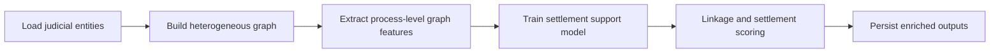

# process-linkage-and-settlement-gnn

## Português

`process-linkage-and-settlement-gnn` é um projeto de ligação e enriquecimento de bases de processos judiciais com mentalidade de `Graph Neural Networks`, voltado a suporte de decisão para análise de acordos.

### Storytelling técnico

Em bases judiciais, o valor raramente está apenas no processo isolado. Muitas decisões dependem do contexto relacional: partes recorrentes, advogados em comum, temas repetidos, fase processual e histórico de comportamento semelhante. É justamente aí que modelagem em grafo faz sentido.

Este projeto foi desenhado com essa lógica:

- materializa uma base sintética de processos, partes, advogados e relações;
- monta um grafo heterogêneo;
- extrai sinais estruturais por processo;
- gera suporte à decisão para acordo judicial;
- mantém um runtime local reproduzível mesmo quando a stack completa de `GNN` não está disponível.

### Objetivo arquitetural

O projeto foi estruturado para mostrar como um problema jurídico pode ser reescrito em forma de grafo para apoiar tarefas que normalmente são difíceis em bases tabulares isoladas:

- ligação de processos por contexto relacional;
- enriquecimento de entidades com vizinhança jurídica;
- recuperação de padrões de recorrência;
- suporte à decisão para análise de acordo.

Em outras palavras, a proposta aqui não é “o modelo decide o acordo”, mas sim “o grafo melhora o contexto disponível para a avaliação do acordo”.

### Arquitetura do projeto

- [src/sample_data.py](/Users/flaviagaia/Documents/CV_FLAVIA_CODEX/process-linkage-and-settlement-gnn/src/sample_data.py)
- [src/modeling.py](/Users/flaviagaia/Documents/CV_FLAVIA_CODEX/process-linkage-and-settlement-gnn/src/modeling.py)
- [main.py](/Users/flaviagaia/Documents/CV_FLAVIA_CODEX/process-linkage-and-settlement-gnn/main.py)
- [tests/test_project.py](/Users/flaviagaia/Documents/CV_FLAVIA_CODEX/process-linkage-and-settlement-gnn/tests/test_project.py)

### Estrutura do grafo

O dataset sintético materializa três tipos principais de nós:

- `process`
- `party`
- `lawyer`

e relações como:

- `parte_em`
- `representa`

Isso permite representar, por exemplo:

- partes que aparecem em múltiplos processos;
- advogados que conectam grupos de casos;
- processos que compartilham contexto relacional mesmo sem texto idêntico.

### Papel técnico de cada arquivo

- [src/sample_data.py](/Users/flaviagaia/Documents/CV_FLAVIA_CODEX/process-linkage-and-settlement-gnn/src/sample_data.py)
  materializa a base sintética de nós e arestas com escrita atômica.
- [src/modeling.py](/Users/flaviagaia/Documents/CV_FLAVIA_CODEX/process-linkage-and-settlement-gnn/src/modeling.py)
  constrói o grafo, extrai sinais estruturais por processo, executa o benchmark local e gera recomendações de suporte a acordo.
- [main.py](/Users/flaviagaia/Documents/CV_FLAVIA_CODEX/process-linkage-and-settlement-gnn/main.py)
  executa o pipeline completo e imprime o sumário consolidado.
- [tests/test_project.py](/Users/flaviagaia/Documents/CV_FLAVIA_CODEX/process-linkage-and-settlement-gnn/tests/test_project.py)
  valida o contrato mínimo do pipeline e a consistência das métricas.

### Pipeline

### Estratégia de modelagem

O projeto usa um runtime `GNN-ready`, mas validado localmente por um fallback baseado em features de grafo. Para cada processo, o pipeline extrai sinais como:

- `party_degree`
- `lawyer_degree`
- `related_process_links`
- `recurring_party`
- `negative_precedent`
- `theme_*`
- `phase_*`

Esses sinais alimentam um benchmark supervisionado para estimar propensão de acordo e apoiar recomendação operacional.

Quando a stack completa de `torch-geometric` estiver disponível, essa base pode evoluir naturalmente para arquiteturas como:

- `GCN`
- `GraphSAGE`
- `GAT`

### Resultados atuais

- `runtime_mode = graph_feature_fallback`
- `node_count = 19`
- `edge_count = 24`
- `process_count = 10`
- `linked_process_groups = 10`
- `accuracy = 0.7500`
- `macro_f1 = 0.7333`
- `roc_auc = 0.7500`

### Interpretação dos resultados

No benchmark atual:

- todos os processos estão em algum grupo relacional enriquecido;
- o classificador local conseguiu distinguir parte relevante dos casos conciliáveis;
- a saída final não é apresentada como decisão automática, e sim como camada de apoio à análise.

Esse posicionamento é importante em contexto jurídico, porque o valor do sistema está em estruturar contexto e priorizar revisão, não em substituir o julgamento humano.

### Artefatos gerados

- tabela enriquecida por processo:
  [data/processed/process_feature_table.csv](/Users/flaviagaia/Documents/CV_FLAVIA_CODEX/process-linkage-and-settlement-gnn/data/processed/process_feature_table.csv)
- suporte à decisão de acordo:
  [data/processed/settlement_support.csv](/Users/flaviagaia/Documents/CV_FLAVIA_CODEX/process-linkage-and-settlement-gnn/data/processed/settlement_support.csv)
- relatório consolidado:
  [data/processed/process_linkage_settlement_report.json](/Users/flaviagaia/Documents/CV_FLAVIA_CODEX/process-linkage-and-settlement-gnn/data/processed/process_linkage_settlement_report.json)
- modelo persistido:
  [artifacts/graph_settlement_model.joblib](/Users/flaviagaia/Documents/CV_FLAVIA_CODEX/process-linkage-and-settlement-gnn/artifacts/graph_settlement_model.joblib)

### Contrato do relatório final

O relatório consolidado registra:

- `runtime_mode`
- `node_count`
- `edge_count`
- `process_count`
- `linked_process_groups`
- `accuracy`
- `macro_f1`
- `roc_auc`
- `feature_artifact`
- `decision_artifact`
- `model_artifact`
- `report_artifact`

## English

`process-linkage-and-settlement-gnn` is a judicial process linkage and enrichment project with a `Graph Neural Networks` mindset, designed to support settlement evaluation with graph-based context.

### Architectural intent

The repository is designed to show how judicial data can be restructured as a graph in order to support:

- process linkage;
- relational enrichment;
- recurrence pattern detection;
- settlement support analysis.

The goal is not to automate legal judgment, but to improve the quality of contextual signals available for settlement evaluation.

### Current results

- `runtime_mode = graph_feature_fallback`
- `node_count = 19`
- `edge_count = 24`
- `process_count = 10`
- `linked_process_groups = 10`
- `accuracy = 0.7500`
- `macro_f1 = 0.7333`
- `roc_auc = 0.7500`
