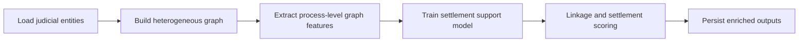

# process-linkage-and-settlement-gnn

## Português

`process-linkage-and-settlement-gnn` é um projeto de ligação e enriquecimento de bases judiciais com mentalidade de `Graph Neural Networks`, agora estruturado sobre um sample dataset no estilo **CourtListener**, voltado a suporte de decisão para análise de acordos.

### Storytelling técnico

Em bases judiciais, o valor raramente está apenas no processo isolado. Quando um analista avalia um caso para possível acordo, ele normalmente quer saber mais do que o texto do processo atual. Ele quer entender:

- se as partes aparecem de forma recorrente;
- se o mesmo advogado ou escritório já esteve envolvido em casos semelhantes;
- se o tribunal ou o juiz aparecem em padrões parecidos;
- se existem outros processos relacionados que terminaram em acordo ou seguiram até decisão.

Esse tipo de pergunta é difícil de responder quando os dados estão espalhados em tabelas independentes. É justamente nesse ponto que a modelagem em grafo faz sentido: ela transforma relações dispersas em estrutura navegável e mensurável.

Este projeto foi desenhado com essa lógica:

- materializa um sample dataset inspirado nos objetos públicos do `CourtListener`;
- monta um grafo heterogêneo com `dockets`, `parties`, `attorneys` e `judges`;
- extrai sinais estruturais por `docket`;
- gera suporte à decisão para acordo judicial;
- mantém um runtime local reproduzível mesmo quando a stack completa de `GNN` não está disponível.

### Objetivo arquitetural

O projeto foi estruturado para mostrar como um problema jurídico pode ser reescrito em forma de grafo para apoiar tarefas que normalmente são difíceis em bases tabulares isoladas:

- ligação de processos por contexto relacional;
- enriquecimento de entidades com vizinhança jurídica;
- recuperação de padrões de recorrência;
- suporte à decisão para análise de acordo.

Em outras palavras, a proposta aqui não é “o modelo decide o acordo”, mas sim “o grafo melhora o contexto disponível para a avaliação do acordo”.

### Explicação dos principais termos

- `docket`
  no contexto do CourtListener, é o registro principal do caso judicial, equivalente ao processo ou ao conjunto de movimentações de uma ação.
- `party`
  representa uma parte do caso, como autor, réu, requerente ou requerido.
- `attorney`
  representa o advogado ou escritório ligado a uma parte.
- `judge`
  representa o magistrado associado ao caso.
- `heterogeneous graph`
  é um grafo com mais de um tipo de nó e mais de um tipo de relação.
- `linkage`
  aqui significa identificar conexões relevantes entre casos e entidades, mesmo quando elas não estão explícitas em uma única tabela.
- `enrichment`
  significa adicionar contexto ao caso atual a partir da estrutura relacional do grafo.
- `settlement support`
  significa gerar sinais de apoio à análise de acordo, sem substituir a decisão humana.

### Arquitetura do projeto

- [src/sample_data.py](/Users/flaviagaia/Documents/CV_FLAVIA_CODEX/process-linkage-and-settlement-gnn/src/sample_data.py)
- [src/modeling.py](/Users/flaviagaia/Documents/CV_FLAVIA_CODEX/process-linkage-and-settlement-gnn/src/modeling.py)
- [main.py](/Users/flaviagaia/Documents/CV_FLAVIA_CODEX/process-linkage-and-settlement-gnn/main.py)
- [tests/test_project.py](/Users/flaviagaia/Documents/CV_FLAVIA_CODEX/process-linkage-and-settlement-gnn/tests/test_project.py)

### Estrutura do grafo

O sample dataset materializa quatro tipos principais de nós:

- `docket`
- `party`
- `attorney`
- `judge`

e relações como:

- `party_in_docket`
- `represents`
- `assigned_to`

Isso permite representar, por exemplo:

- partes que aparecem em múltiplos dockets;
- attorneys que conectam grupos de casos;
- judges compartilhados entre dockets;
- dockets que compartilham contexto relacional mesmo sem texto idêntico.

### Por que o CourtListener foi escolhido como referência

O `CourtListener` é uma referência pública muito conhecida em dados jurídicos porque expõe objetos reais do ecossistema judicial, como `dockets`, `parties`, `attorneys` e `opinions`. Mesmo usando um sample dataset local, a escolha desse schema ajuda a deixar o projeto mais próximo de um cenário real do que uma base jurídica genérica.

Isso também melhora o valor do portfólio, porque mostra não só a ideia de grafo, mas uma modelagem inspirada em uma estrutura jurídica pública e reconhecida.

### Papel técnico de cada arquivo

- [src/sample_data.py](/Users/flaviagaia/Documents/CV_FLAVIA_CODEX/process-linkage-and-settlement-gnn/src/sample_data.py)
  materializa um sample dataset no estilo `CourtListener` com escrita atômica.
- [src/modeling.py](/Users/flaviagaia/Documents/CV_FLAVIA_CODEX/process-linkage-and-settlement-gnn/src/modeling.py)
  constrói o grafo, extrai sinais estruturais por processo, executa o benchmark local e gera recomendações de suporte a acordo.
- [main.py](/Users/flaviagaia/Documents/CV_FLAVIA_CODEX/process-linkage-and-settlement-gnn/main.py)
  executa o pipeline completo e imprime o sumário consolidado.
- [tests/test_project.py](/Users/flaviagaia/Documents/CV_FLAVIA_CODEX/process-linkage-and-settlement-gnn/tests/test_project.py)
  valida o contrato mínimo do pipeline e a consistência das métricas.

### Pipeline

### Estratégia de modelagem

O projeto usa um runtime `GNN-ready`, mas validado localmente por um fallback baseado em features de grafo. Para cada `docket`, o pipeline extrai sinais como:

- `party_degree`
- `attorney_degree`
- `judge_degree`
- `related_docket_links`
- `repeat_player_signal`
- `negative_precedent_signal`
- `nature_*`
- `court_*`

Esses sinais alimentam um benchmark supervisionado para estimar propensão de acordo e apoiar recomendação operacional.

Em termos práticos:

- `party_degree`
  mede quantas partes estão conectadas ao docket;
- `attorney_degree`
  mede quantos advogados aparecem no entorno daquele caso;
- `judge_degree`
  mede a presença relacional do magistrado na estrutura analisada;
- `related_docket_links`
  mede quantos outros dockets estão conectados por entidades compartilhadas;
- `repeat_player_signal`
  representa presença de parte recorrente, algo muito relevante em litígios massificados;
- `negative_precedent_signal`
  representa um sinal simplificado de contexto desfavorável ao réu;
- `nature_*` e `court_*`
  codificam natureza da ação e tribunal, preservando contexto jurídico mínimo.

Quando a stack completa de `torch-geometric` estiver disponível, essa base pode evoluir naturalmente para arquiteturas como:

- `GCN`
- `GraphSAGE`
- `GAT`

### Resultados atuais

- `runtime_mode = graph_feature_fallback`
- `dataset_source = courtlistener_style_sample`
- `node_count = 19`
- `edge_count = 37`
- `docket_count = 10`
- `linked_docket_groups = 10`
- `accuracy = 0.7500`
- `macro_f1 = 0.7333`
- `roc_auc = 0.7500`

### Interpretação dos resultados

No benchmark atual:

- todos os dockets estão em algum grupo relacional enriquecido;
- o classificador local conseguiu distinguir parte relevante dos casos conciliáveis;
- a saída final não é apresentada como decisão automática, e sim como camada de apoio à análise.

Esse posicionamento é importante em contexto jurídico, porque o valor do sistema está em estruturar contexto e priorizar revisão, não em substituir o julgamento humano.

### Como isso poderia evoluir para uma GNN real

Hoje o projeto usa um fallback supervisionado sobre features derivadas do grafo, porque esse caminho é mais leve e reproduzível no ambiente local. Mas a modelagem já foi preparada com mentalidade `GNN-ready`.

Os próximos passos naturais seriam:

- transformar nós e arestas em tensores de grafo;
- usar `GCN`, `GraphSAGE` ou `GAT`;
- aprender embeddings dos dockets a partir da vizinhança;
- usar esses embeddings para:
  - classificação de propensão de acordo;
  - recuperação de casos semelhantes;
  - previsão de links entre entidades e casos.

### Artefatos gerados

- tabela enriquecida por processo:
  [data/processed/process_feature_table.csv](/Users/flaviagaia/Documents/CV_FLAVIA_CODEX/process-linkage-and-settlement-gnn/data/processed/process_feature_table.csv)
- suporte à decisão de acordo:
  [data/processed/settlement_support.csv](/Users/flaviagaia/Documents/CV_FLAVIA_CODEX/process-linkage-and-settlement-gnn/data/processed/settlement_support.csv)
- relatório consolidado:
  [data/processed/process_linkage_settlement_report.json](/Users/flaviagaia/Documents/CV_FLAVIA_CODEX/process-linkage-and-settlement-gnn/data/processed/process_linkage_settlement_report.json)
- modelo persistido:
  [artifacts/graph_settlement_model.joblib](/Users/flaviagaia/Documents/CV_FLAVIA_CODEX/process-linkage-and-settlement-gnn/artifacts/graph_settlement_model.joblib)
- dockets no estilo CourtListener:
  [data/raw/dockets.csv](/Users/flaviagaia/Documents/CV_FLAVIA_CODEX/process-linkage-and-settlement-gnn/data/raw/dockets.csv)
- parties:
  [data/raw/parties.csv](/Users/flaviagaia/Documents/CV_FLAVIA_CODEX/process-linkage-and-settlement-gnn/data/raw/parties.csv)
- attorneys:
  [data/raw/attorneys.csv](/Users/flaviagaia/Documents/CV_FLAVIA_CODEX/process-linkage-and-settlement-gnn/data/raw/attorneys.csv)
- judges:
  [data/raw/judges.csv](/Users/flaviagaia/Documents/CV_FLAVIA_CODEX/process-linkage-and-settlement-gnn/data/raw/judges.csv)

### Contrato do relatório final

O relatório consolidado registra:

- `runtime_mode`
- `dataset_source`
- `node_count`
- `edge_count`
- `docket_count`
- `linked_docket_groups`
- `accuracy`
- `macro_f1`
- `roc_auc`
- `feature_artifact`
- `decision_artifact`
- `model_artifact`
- `report_artifact`

## English

`process-linkage-and-settlement-gnn` is a judicial data linkage and enrichment project with a `Graph Neural Networks` mindset, now structured around a **CourtListener-style** sample dataset to support settlement evaluation with graph-based context.

### Architectural intent

The repository is designed to show how judicial data can be restructured as a graph in order to support:

- process linkage;
- relational enrichment;
- recurrence pattern detection;
- settlement support analysis.

The goal is not to automate legal judgment, but to improve the quality of contextual signals available for settlement evaluation.

### Technical vocabulary

- `docket`
  the primary court case record in CourtListener-style data.
- `party`
  a plaintiff, defendant, petitioner, respondent, or other case participant.
- `attorney`
  a lawyer or law office connected to a party.
- `judge`
  the judicial actor assigned to a case.
- `heterogeneous graph`
  a graph with multiple node types and multiple edge types.
- `linkage`
  the task of identifying meaningful relationships across cases and entities.
- `enrichment`
  the task of adding relational context to a case through graph structure.
- `settlement support`
  decision support signals for settlement analysis, not automated legal judgment.

### Current results

- `runtime_mode = graph_feature_fallback`
- `dataset_source = courtlistener_style_sample`
- `node_count = 19`
- `edge_count = 37`
- `docket_count = 10`
- `linked_docket_groups = 10`
- `accuracy = 0.7500`
- `macro_f1 = 0.7333`
- `roc_auc = 0.7500`
